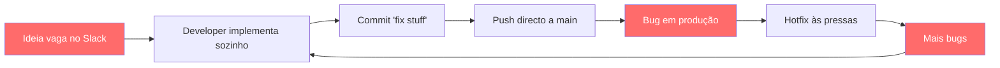

## O Caos do Desenvolvimento Sem Framework

Antes de falar do AIOS, vamos falar do que acontece **sem ele**. Se já trabalhaste num projecto de software — sozinho ou em equipa — reconheces pelo menos alguns destes cenários:

### Cenário 1: Commits Soltos Sem Convenção

```
fix stuff
update
wip
asdasd
more changes
finally works
```

Sem convenção de commits, o histórico do git torna-se inútil. Ninguém sabe o que mudou, porquê, ou em que contexto. Quando algo parte em produção, o `git log` não ajuda — é uma lista de ruído.

**O custo real:** Horas perdidas a fazer `git bisect` manual, PRs incompreensíveis, onboarding de novos developers é um pesadelo.

### Cenário 2: Sem Rastreio de Stories ou Requisitos

O developer recebe um Slack: *"precisamos de um botão de export"*. Não há story. Não há acceptance criteria. Não há definição de done.

Resultado:
- O developer implementa o que **acha** que é preciso
- O PM queria outra coisa
- Retrabalho de 2-3 dias
- Ninguém documenta a decisão final

**O custo real:** Features que ninguém pediu, scope creep constante, zero rastreabilidade entre requisito e código.

### Cenário 3: QA Inexistente ou Manual

```
"Funciona na minha máquina" → merge → produção parte
```

Sem quality gates:
- Código entra em `main` sem revisão
- Testes existem mas ninguém os corre
- Lint e typecheck são "coisas para depois"
- Bugs chegam ao utilizador final

**O custo real:** Hotfixes às 23h, perda de confiança dos utilizadores, dívida técnica que cresce exponencialmente.

---

## O Que É Um AI-Orchestrated System

Um **AI-Orchestrated System** (AIOS) é um meta-framework que usa agentes de IA especializados para orquestrar todo o ciclo de desenvolvimento de software — desde requisitos até deploy.

Em vez de um único assistente genérico que "ajuda com tudo", o AIOS define **10 agentes com papéis distintos e autoridade exclusiva**: um Product Manager que cria épicos, um Scrum Master que escreve stories, um Developer que implementa, um QA que valida, um DevOps que faz push. Cada um sabe exactamente o que pode e não pode fazer.

O diferencial não é a IA em si — é a **orquestração**. Os agentes seguem workflows formais, usam templates padronizados, e são governados por uma Constitution com regras inegociáveis. O resultado é um processo que é repetível, rastreável e com qualidade garantida por gates automáticos.

---

## Before / After — O AIOS Transforma o Workflow

### ❌ Sem AIOS (Fluxo Caótico)



**Problemas:**
- Nenhum requisito formal
- Nenhuma validação antes do código
- Nenhum quality gate
- Ciclo vicioso de bugs

### ✅ Com AIOS (Fluxo Orquestrado)


**Resultado:**
- Cada passo tem um dono com autoridade exclusiva
- Quality gates bloqueiam código sem qualidade
- Tudo é rastreável — da story ao commit
- Sem surpresas em produção

---

## Demonstração Rápida: Um Ciclo Completo em 5 Minutos

Imagina que precisas de adicionar uma feature de "export para CSV". Com o AIOS, o fluxo é:

```
1. @pm *create-epic          → Define o épico com requisitos
2. @sm *draft                → Cria a story com acceptance criteria
3. @po *validate-story-draft → Valida (GO se ≥7/10 pontos)
4. @dev *develop             → Implementa o código
5. @qa *qa-gate              → 7 quality checks (PASS/FAIL)
6. @devops *push             → Push + PR criado automaticamente
```

Cada agente:
- Sabe exactamente o que fazer (task files)
- Produz output padronizado (templates)
- É validado automaticamente (checklists)
- Passa o contexto ao próximo (handoff)

**Zero ambiguidade. Zero retrabalho. Rastreabilidade total.**

---

## Exercício

**Lista 5 problemas do teu workflow actual que o AIOS pode resolver.**

Pensa no teu dia-a-dia de desenvolvimento. Onde perdes mais tempo? Onde há mais fricção? Exemplos para te inspirar:

1. _"Nunca sei quando uma feature está realmente 'done'"_
2. _"Os commits não seguem nenhuma convenção"_
3. _"Não temos quality gates — código vai directo para main"_
4. _"Requirements mudam a meio da implementação"_
5. _"Onboarding de novos developers demora semanas"_

Escreve os teus 5 problemas. Vamos voltar a eles no final do curso para ver quantos o AIOS resolveu.
