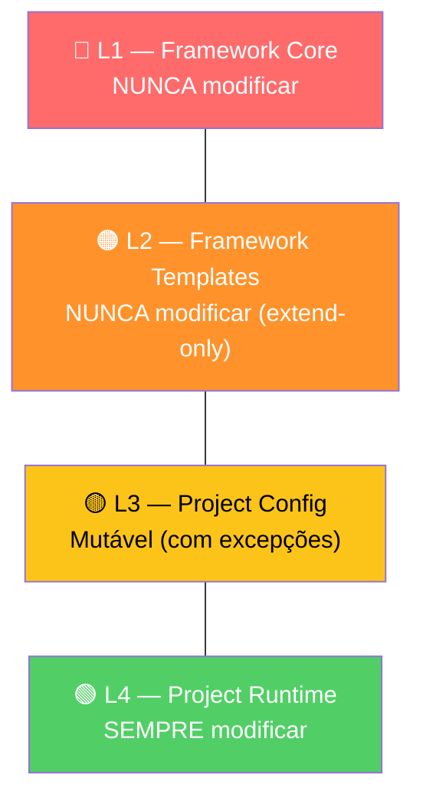

O AIOS não é apenas uma colecção de ferramentas — é governado por uma **Constitution formal** com princípios inegociáveis. Violá-los bloqueia automaticamente a operação. Isto não é opcional: é o que garante consistência e qualidade em qualquer projecto.

---

## Os 6 Artigos da Constitution

### Artigo I — CLI First `NON-NEGOTIABLE`

**O que diz:** A CLI é a fonte da verdade. Toda a execução, decisões e automação vivem na CLI.

**O que significa na prática:**
- Funcionalidades novas devem funcionar 100% via CLI antes de ter qualquer UI
- Dashboards observam, nunca controlam
- A UI nunca é requisito para operar o sistema

**Exemplo:** Queres ver o estado de um workflow? Usas `*status` na CLI — não precisas de um dashboard. Se um dia houver dashboard, ele apenas mostra o que a CLI já sabe.

---

### Artigo II — Agent Authority `NON-NEGOTIABLE`

**O que diz:** Cada agente tem autoridade exclusiva sobre o seu domínio. Nenhum agente pode executar operações de outro.

**O que significa na prática:**
- Apenas `@devops` pode fazer `git push` — se `@dev` tentar, é bloqueado
- Apenas `@sm` cria stories — `@dev` não pode alterar acceptance criteria
- Apenas `@po` valida stories — ninguém mais pode dar GO/NO-GO

**Exemplo:** O `@dev` acabou de implementar uma feature e quer fazer push. Não pode. Tem de pedir ao `@devops`: é uma delegação explícita, não uma limitação — é uma garantia de que o push passa pelos quality gates correctos.

---

### Artigo III — Story-Driven Development `MUST`

**O que diz:** Todo o trabalho começa com uma story. Sem story, sem código.

**O que significa na prática:**
- Antes de escrever uma linha de código, existe uma story com acceptance criteria
- O progresso é rastreado via checkboxes na story
- Cada commit referencia a story: `feat: implement export [Story 2.1]`

**Exemplo:** Um developer quer "refactorizar o módulo de auth". Sem story, não avança. Primeiro: `@sm *draft` para criar a story, `@po *validate` para validar, só depois `@dev` implementa.

---

### Artigo IV — No Invention `MUST`

**O que diz:** Tudo no spec deve rastrear a um requisito formal (FR-*, NFR-*, CON-*). Nada inventado.

**O que significa na prática:**
- Cada feature no spec liga-se a um requisito documentado
- Se não está no PRD, não entra no spec
- Zero "já que estamos aqui, vamos adicionar X"

**Exemplo:** Durante a implementação de "export CSV", o developer pensa "vou adicionar export para Excel também". Stop. Não há requisito para Excel. Se faz sentido, volta ao `@pm` para criar o requisito — só depois é implementado.

---

### Artigo V — Quality First `MUST`

**O que diz:** Quality gates são obrigatórios, não opcionais.

**O que significa na prática:**
- Toda story passa por QA Gate (7 checks) antes de ser "Done"
- Pre-push gates: `npm run lint` + `npm run typecheck` + `npm test`
- Se falha, não avança — sem excepções

**Exemplo:** O `@dev` terminou a implementação mas o lint falha. O código não é pushed. O `@qa` devolve com feedback específico, o `@dev` corrige, e só avança quando os 7 checks passam.

---

### Artigo VI — Absolute Imports `SHOULD`

**O que diz:** Imports absolutos, nunca relativos.

**O que significa na prática:**
```typescript
// ✅ Correcto
import { useStore } from '@/stores/feature/store'

// ❌ Errado
import { useStore } from '../../../stores/feature/store'
```

**Exemplo:** Ao mover um ficheiro de pasta, imports absolutos continuam a funcionar. Imports relativos partem e criam cascatas de erros.

---

## Hierarquia de Prioridades

O AIOS segue uma hierarquia estrita que guia **todas** as decisões:

```
CLI First → Observability Second → UI Third
```

| Camada | Prioridade | Papel |
|--------|------------|-------|
| **CLI** | Máxima | Onde a inteligência vive. Toda execução, decisões e automação. |
| **Observability** | Secundária | Observar e monitorar o que acontece na CLI em tempo real. |
| **UI** | Terciária | Gestão pontual e visualizações quando necessário. |

**Porquê esta ordem?**

1. **A CLI é determinística** — mesmos inputs, mesmos outputs. Uma UI introduz estado visual, cliques, e ambiguidade.
2. **Observability sem controlo** — um dashboard que mostra métricas é útil. Um dashboard que permite "skippar" um QA gate é perigoso.
3. **A UI é opcional** — o sistema funciona integralmente sem ela. Se a UI partir, nada pára. Se a CLI partir, tudo pára.

---

## Framework Boundary — As 4 Camadas

O AIOS separa artefactos em 4 camadas de mutabilidade. Isto protege o core do framework de modificações acidentais.



| Camada | Mutabilidade | O que contém | Exemplos reais |
|--------|-------------|--------------|----------------|
| **L1** Framework Core | NUNCA | Motor principal, Constitution, CLI | `.aios-core/core/`, `.aios-core/constitution.md`, `bin/aios.js` |
| **L2** Framework Templates | NUNCA (extend-only) | Tasks, templates, checklists, workflows | `.aios-core/development/tasks/`, `.aios-core/development/templates/` |
| **L3** Project Config | Mutável | Knowledge base, entity registry, config | `.aios-core/data/`, `core-config.yaml`, `agents/*/MEMORY.md` |
| **L4** Project Runtime | SEMPRE | Stories, código, squads, testes | `docs/stories/`, `packages/`, `squads/`, `tests/` |

**Regra prática:**
- **L1/L2:** Não toques. Estão protegidos por deny rules em `.claude/settings.json`.
- **L3:** Podes editar configuração do projecto, mas com cuidado.
- **L4:** É aqui que vives. Stories, código, testes — tudo teu.

---

## Gates Automáticos

As camadas não são protegidas apenas por convenção — são reforçadas por **deny rules** automáticas.

### Como funciona

O ficheiro `.claude/settings.json` contém regras que bloqueiam edições a ficheiros L1/L2:

```json
{
  "deny": [
    ".aios-core/core/**",
    ".aios-core/constitution.md",
    "bin/aios.js",
    "bin/aios-init.js"
  ]
}
```

Se qualquer agente tentar modificar um ficheiro protegido, a operação é **bloqueada antes de executar**.

### Exemplo de violação

```
@dev tenta editar .aios-core/core/orchestration/engine.js
→ BLOQUEADO: ficheiro em L1 (Framework Core)
→ Deny rule: .aios-core/core/**
→ Acção: operação rejeitada, agente notificado
```

### Toggle de protecção

Para contribuidores do framework (não utilizadores normais):

```yaml
# core-config.yaml
boundary:
  frameworkProtection: false  # Desactiva deny rules (apenas para devs do framework)
```

Por defeito, `frameworkProtection: true` — e deve ficar assim para qualquer projecto que usa o AIOS.

---

## Exercício

**Identifica a camada (L1-L4) de cada ficheiro:**

| # | Ficheiro | Camada? |
|---|----------|---------|
| 1 | `.aios-core/core/orchestration/engine.js` | |
| 2 | `docs/stories/active/2.1.story.md` | |
| 3 | `.aios-core/development/tasks/dev-develop-story.md` | |
| 4 | `packages/auth/src/login.ts` | |
| 5 | `core-config.yaml` | |
| 6 | `bin/aios.js` | |
| 7 | `.aios-core/development/templates/story-tmpl.yaml` | |
| 8 | `tests/unit/auth.test.ts` | |
| 9 | `.aios-core/data/tool-registry.yaml` | |
| 10 | `.aios-core/constitution.md` | |

**Respostas:** 1-L1, 2-L4, 3-L2, 4-L4, 5-L3, 6-L1, 7-L2, 8-L4, 9-L3, 10-L1
