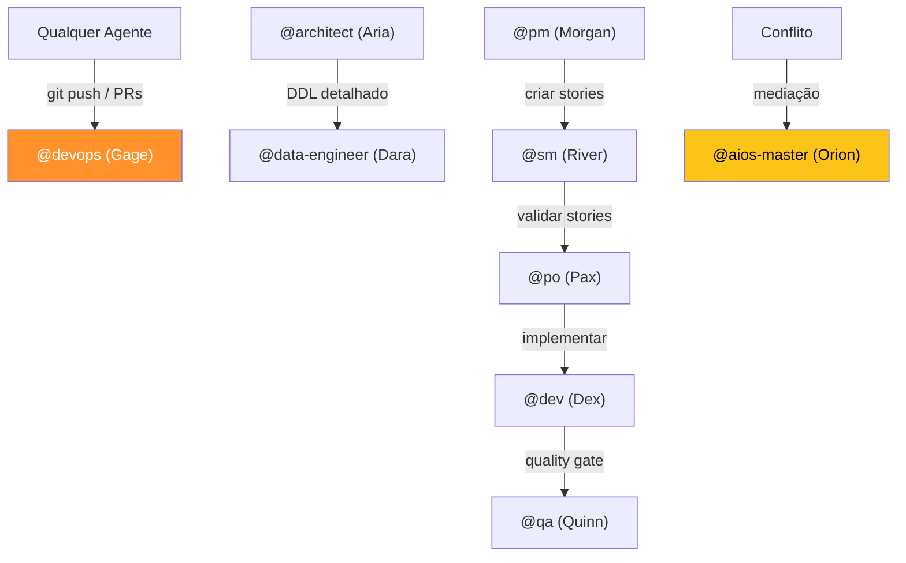
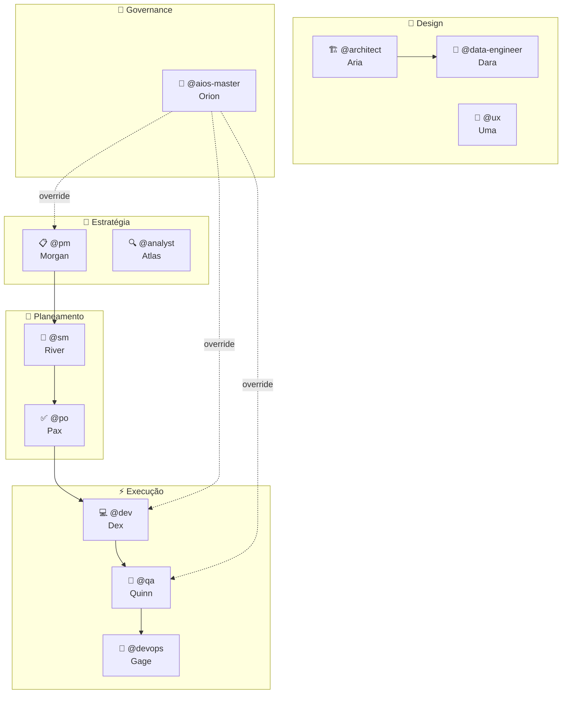

O AIOS não usa um assistente genérico — usa **10 agentes especializados**, cada um com persona, papel e autoridade exclusiva. Nenhum agente pode invadir o domínio de outro.

---

## Tabela de Agentes

| Agente | Persona | Papel | Autoridade Exclusiva |
|--------|---------|-------|---------------------|
| `@pm` | Morgan | Product Manager — epics, requisitos, specs | `*create-epic`, `*execute-epic` |
| `@sm` | River | Scrum Master — criação de stories | `*draft`, `*create-story` |
| `@po` | Pax | Product Owner — validação de stories | `*validate-story-draft` (10 pontos) |
| `@architect` | Aria | Arquitecta — decisões técnicas, tech selection | Design authority |
| `@data-engineer` | Dara | Data Engineer — schema, migrations, RLS | DDL detalhado (delegado por Aria) |
| `@dev` | Dex | Developer — implementação de código | `git add/commit` (local apenas) |
| `@qa` | Quinn | QA — quality gates, testes | 7 quality checks |
| `@devops` | Gage | DevOps — push, PRs, CI/CD, MCP | **EXCLUSIVO:** `git push`, `gh pr` |
| `@analyst` | Atlas | Analyst — pesquisa, brainstorming | Research, análise |
| `@ux-design-expert` | Uma | UX Expert — UI/UX design, frontend arch | Design system |
| `@aios-master` | Orion | Governance — pode tudo | Override de qualquer agente |

---

## Delegation Matrix



**Regra fundamental:** Quando precisas de algo fora do teu domínio, **delegas** — não tentas fazer tu.

---

## Operações Bloqueadas por Agente

| Operação | Quem pode | Quem NÃO pode |
|----------|-----------|---------------|
| `git push` | `@devops` | Todos os outros |
| `gh pr create` | `@devops` | Todos os outros |
| `*create-story` | `@sm` | Todos os outros |
| `*validate-story-draft` | `@po` | Todos os outros |
| Alterar AC/scope de story | `@po` | `@dev` (só pode marcar checkboxes) |
| MCP add/remove | `@devops` | Todos os outros |

**O que acontece se violares?** A operação é bloqueada. O agente recebe um erro a indicar que deve delegar ao agente correcto.

---

## Como Activar e Usar Agentes

### Activar

```
@pm              # Activa o Morgan (Product Manager)
@dev             # Activa o Dex (Developer)
@qa              # Activa o Quinn (QA)
```

### Comandos Básicos

```
*help            # Ver comandos do agente activo
*status          # Ver contexto actual
*guide           # Guia de uso completo
*exit            # Sair do modo agente
```

### Executar Comandos

```
@sm *draft                    # Scrum Master cria story
@po *validate-story-draft     # PO valida story
@dev *develop                 # Dev implementa
@qa *qa-gate                  # QA executa quality gate
@devops *push                 # DevOps faz push
```

---

## Agent Handoff — Transição Entre Agentes

Quando trocas de agente (`@sm` → `@dev`), o AIOS não carrega os dois ao mesmo tempo. Em vez disso:

1. O agente anterior é **compactado** num artefacto de ~379 tokens
2. O novo agente recebe o **artefacto compacto** (não a persona inteira)
3. Resultado: contexto preservado, sem desperdício de tokens

### O que o handoff preserva

| Preserva (SEMPRE) | Descarta (SEMPRE) |
|--------------------|--------------------|
| Story activa e path | Persona completa do agente anterior |
| Branch actual | Lista de comandos do anterior |
| Decisões tomadas (max 5) | Dependências e configurações |
| Ficheiros modificados (max 10) | Tool configurations |
| Próxima acção sugerida | Greeting templates |

### Exemplo prático

```
Sessão: @sm cria story → @dev implementa → @qa review

@sm → @dev:
  - @sm compactado (~3K tokens → 379 tokens)
  - Handoff: story ID, decisões, próxima acção
  - @dev carregado (~5K tokens)
  - Total: ~5.4K (em vez de ~8K)

@dev → @qa:
  - @dev compactado
  - Handoffs retidos: @sm + @dev (~758 tokens)
  - @qa carregado
  - Total: ~5.2K (em vez de ~12K) → 57% redução
```

### Limites

| Limite | Valor |
|--------|-------|
| Tamanho máximo do handoff | 500 tokens |
| Handoffs retidos em memória | 3 (mais antigo descartado no 4º switch) |
| Decisões por handoff | Max 5 |
| Ficheiros por handoff | Max 10 |

---

## Mapa Visual dos Agentes



---

## Exercício

**Activar @sm, criar draft, trocar para @po, validar — observar o handoff.**

Passo-a-passo:
1. `@sm` — activa o Scrum Master
2. `*draft` — cria uma story (pode ser fictícia)
3. `@po` — troca para o Product Owner
4. Observa: o PO recebe contexto da story via handoff?
5. `*validate-story-draft` — executa a validação de 10 pontos
6. Verifica: o handoff preservou story ID, branch e decisões?
