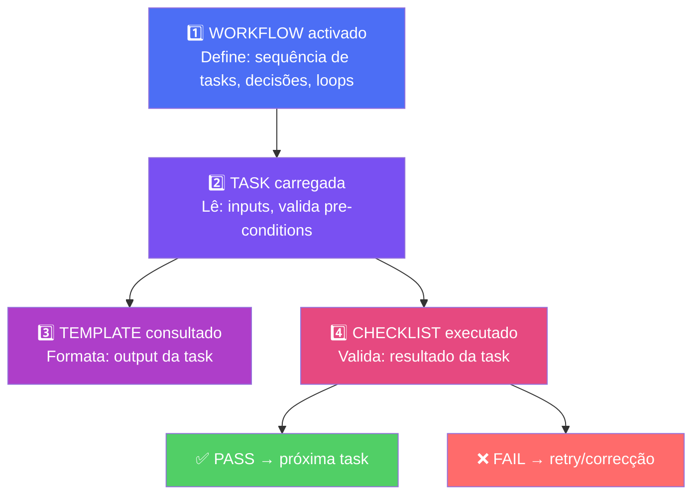

O AIOS funciona como um motor com 4 peças encaixadas. Cada peça tem um papel específico e é consultada numa ordem precisa. Entender esta engrenagem é entender como o AIOS executa qualquer trabalho.

---

## As 4 Peças

| Peça | O que é | Localização | Quando é consultada |
|------|---------|-------------|---------------------|
| **Workflow** | Orquestração — define a sequência de tasks | `.aios-core/development/workflows/` | **PRIMEIRO** — define a ordem |
| **Task** | Workflow executável — define inputs, outputs, passos | `.aios-core/development/tasks/` | **SEGUNDO** — carregada pelo workflow |
| **Template** | Formato do output — estrutura do artefacto gerado | `.aios-core/development/templates/` | **TERCEIRO** — durante execução da task |
| **Checklist** | Validação — critérios pass/fail | `.aios-core/development/checklists/` | **QUARTO** — no final da task |

---

## Ordem de Consulta



**Fluxo detalhado:**

```
1. WORKFLOW activado
   │  Define: sequência de tasks, decisões, loops
   │  Exemplo: Story Development Cycle
   │
   ▼
2. TASK carregada
   │  Lê: inputs, valida pre-conditions
   │  Exemplo: dev-develop-story.md
   │  Contém: passos detalhados, modos de execução
   │
   ├──▶ 3. TEMPLATE consultado (DURANTE)
   │       Formata: output da task
   │       Exemplo: story-tmpl.yaml → gera X.Y.story.md
   │
   └──▶ 4. CHECKLIST executado (NO FINAL)
           Valida: resultado da task
           Exemplo: qa-checklist.md → PASS/FAIL
           │
           ├── ✅ PASS → workflow avança para próxima task
           └── ❌ FAIL → retry, correcção, ou escalação
```

---

## Exemplo Concreto: Criar uma Story

Vamos traçar o fluxo completo do Story Development Cycle (SDC):

```
Workflow: Story Development Cycle (SDC)
  │
  ├── Task: create-next-story.md          ← @sm executa
  │   ├── Template: story-tmpl.yaml       ← formata a story
  │   └── Checklist: story-checklist.md   ← valida estrutura
  │
  ├── Task: validate-next-story.md        ← @po executa
  │   └── Checklist: 10-point validation  ← GO/NO-GO
  │
  ├── Task: dev-develop-story.md          ← @dev executa
  │   └── Checklist: code quality checks  ← lint, typecheck, tests
  │
  └── Task: qa-gate.md                    ← @qa executa
      └── Checklist: 7 quality checks     ← PASS/FAIL/CONCERNS
```

Cada task sabe:
- **Quem** a executa (agente)
- **O que** recebe (inputs)
- **O que** produz (outputs via template)
- **Como** é validada (checklist)

---

## Anatomia de uma Task

As tasks vivem em `.aios-core/development/tasks/` e seguem esta estrutura:

```markdown
---
id: dev-develop-story
name: Develop Story
agent: dev
category: development
complexity: medium
---

# Develop Story

## Input (o que recebe)
- Story file path (X.Y.story.md)
- Story status: Ready

## Output (o que produz)
- Código implementado conforme AC
- Story checkboxes actualizados
- File List na story actualizado

## Process (passos a executar)
1. Ler story e acceptance criteria
2. Criar branch: feat/story-X.Y
3. Implementar cada AC
4. Correr lint + typecheck + tests
5. Actualizar checkboxes na story
6. Actualizar File List

## Modes (modos de execução)
- **Interactive:** Confirma cada passo com o utilizador
- **YOLO:** Executa tudo autonomamente
- **Pre-Flight:** Mostra plano sem executar

## Checklist (pre/post-conditions)
### Pre-conditions
- [ ] Story existe e tem status Ready
- [ ] Branch criado a partir de main

### Post-conditions
- [ ] Todos os AC implementados
- [ ] Lint passa sem erros
- [ ] Typecheck passa sem erros
- [ ] Testes passam

## Error Handling
- Lint falha → corrigir antes de avançar
- Typecheck falha → corrigir tipos
- Test falha → debug e fix
```

**Pontos-chave:**
- O frontmatter (`id`, `agent`, `complexity`) identifica a task
- `Process` é a sequência de passos — o agente segue-a literalmente
- `Modes` permite executar a mesma task de formas diferentes
- `Checklist` garante qualidade no início e no fim

---

## Anatomia de um Template

Templates vivem em `.aios-core/development/templates/` e definem o formato do output:

```yaml
# story-tmpl.yaml
name: Story Template
version: 1.0.0
output_format: markdown

sections:
  - name: header
    content: |
      # {epicNum}.{storyNum} Story: {title}
      **Status:** {status}
      **Agent:** {agent}

  - name: user_story
    content: |
      > Como **{persona}**,
      > quero {want},
      > para que {benefit}.

  - name: acceptance_criteria
    content: |
      ## Acceptance Criteria
      {criteria_list}

  - name: file_list
    content: |
      ## File List
      | File | Action | Description |
      |------|--------|-------------|
```

O template não contém lógica — é um **molde**. A task preenche os campos (`{title}`, `{status}`, etc.) durante a execução.

---

## Anatomia de uma Checklist

Checklists vivem em `.aios-core/development/checklists/` e definem critérios pass/fail:

```markdown
# Story DoD Checklist

## Pre-conditions (antes de executar)
- [ ] Story tem status Ready
- [ ] Branch criado a partir de main
- [ ] Nenhum blocker activo

## Implementation Checks
- [ ] Todos os AC implementados
- [ ] Código segue convenções de naming
- [ ] Imports absolutos (Art. VI)
- [ ] Sem `any` em TypeScript

## Quality Checks
- [ ] `npm run lint` passa
- [ ] `npm run typecheck` passa
- [ ] `npm test` passa
- [ ] Sem vulnerabilidades de segurança

## Documentation
- [ ] File List actualizado na story
- [ ] Checkboxes da story marcados
- [ ] Commit message segue Conventional Commits
```

**Verdicts:**
- **PASS:** Todos os checks ✅ → workflow avança
- **FAIL:** Algum check ❌ → volta ao agente para correcção
- **CONCERNS:** Checks passam mas com observações → pode avançar com notas

---

## Exercício

**Abrir `dev-develop-story.md`, identificar templates e checklists referenciados, e traçar o fluxo completo.**

1. Localiza a task em `.aios-core/development/tasks/dev-develop-story.md`
2. Identifica: que templates usa? Que checklists referencia?
3. Desenha o fluxo: Input → Process → Template (output) → Checklist (validação)
4. Pergunta: o que acontece se o checklist falhar no passo 4?
