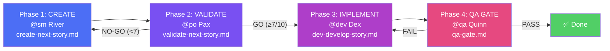
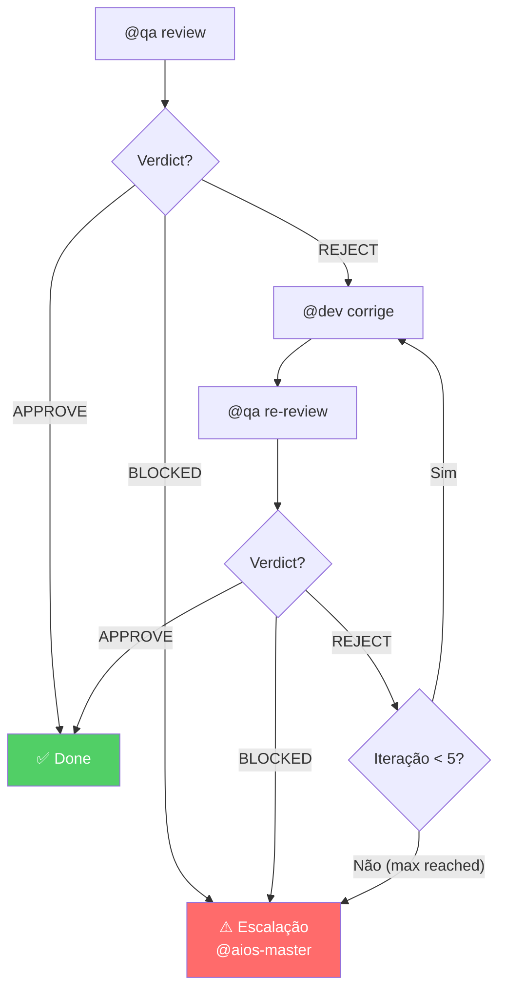
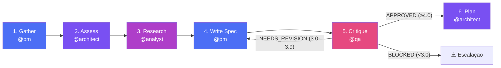
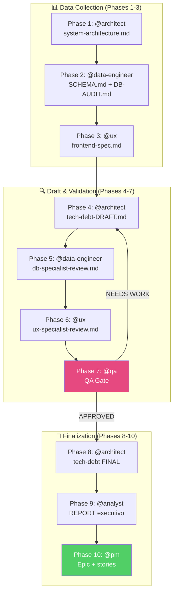

O AIOS tem 4 workflows que cobrem todas as situações de desenvolvimento. Saber qual usar em cada cenário é a diferença entre um processo fluido e um caos organizado.

---

## Workflow 1: Story Development Cycle (SDC)

O workflow **principal** — usado para todo o desenvolvimento. 4 fases obrigatórias.



### Fases em detalhe

| Fase | Agente | Task | Output | Decisão |
|------|--------|------|--------|---------|
| 1. Create | @sm | `create-next-story.md` | `X.Y.story.md` (Draft) | — |
| 2. Validate | @po | `validate-next-story.md` | Checklist 10 pontos | GO (≥7) / NO-GO |
| 3. Implement | @dev | `dev-develop-story.md` | Código + testes | — |
| 4. QA Gate | @qa | `qa-gate.md` | 7 quality checks | PASS / FAIL / CONCERNS / WAIVED |

### Transições de Status da Story

```
Draft → Ready (PO valida GO) → InProgress (Dev começa) → InReview (QA) → Done (QA PASS)
```

---

## Workflow 2: QA Loop

Ciclo **iterativo** de review/fix após o QA Gate inicial. Automático, com limite de 5 iterações.



### Comandos

| Comando | Acção |
|---------|-------|
| `*qa-loop {storyId}` | Iniciar loop |
| `*qa-loop-review` | Resumir da review |
| `*qa-loop-fix` | Resumir do fix |
| `*stop-qa-loop` | Pausar, guardar estado |
| `*resume-qa-loop` | Resumir do estado |
| `*escalate-qa-loop` | Forçar escalação |

### Verdicts

| Verdict | O que acontece |
|---------|----------------|
| **APPROVE** | Story marcada Done ✅ |
| **REJECT** | @dev corrige, @qa re-review |
| **BLOCKED** | Escalação imediata a @aios-master |

### Triggers de Escalação

- `max_iterations_reached` — 5 iterações sem APPROVE
- `verdict_blocked` — QA detecta blocker
- `fix_failure` — @dev não consegue corrigir
- `manual_escalate` — escalação forçada

---

## Workflow 3: Spec Pipeline

Transforma requisitos informais em **spec executável**. A complexidade determina quantas fases.



### Classes de Complexidade

A complexidade é calculada por 5 dimensões (scored 1-5): Scope, Integration, Infrastructure, Knowledge, Risk.

| Score Total | Classe | Fases Executadas |
|-------------|--------|------------------|
| ≤ 8 | **SIMPLE** | gather → spec → critique (3 fases) |
| 9-15 | **STANDARD** | Todas as 6 fases |
| ≥ 16 | **COMPLEX** | 6 fases + ciclo de revisão |

### Critique Verdicts

| Verdict | Score Médio | Próximo Passo |
|---------|------------|---------------|
| APPROVED | ≥ 4.0 | Avança para Plan (Fase 6) |
| NEEDS_REVISION | 3.0-3.9 | Volta para Write Spec (Fase 4) |
| BLOCKED | < 3.0 | Escalação a @architect |

### Gate Constitutional (Art. IV — No Invention)

Cada afirmação no spec **deve** rastrear a um requisito formal:
- `FR-*` (Functional Requirement)
- `NFR-*` (Non-Functional Requirement)
- `CON-*` (Constraint)
- Research finding

Se algo no spec não tem rastreio → **violação do Art. IV** → bloqueado.

---

## Workflow 4: Brownfield Discovery

Assessment completo de **tech debt** para projectos existentes. 10 fases em 3 grupos.



### QA Gate Intermédio (Phase 7)

| Verdict | O que acontece |
|---------|----------------|
| **APPROVED** | Todos os debits validados, dependencies mapeadas → Phase 8 |
| **NEEDS WORK** | Gaps não resolvidos → volta à Phase 4 para revisão |

---

## Tabela de Decisão

| Cenário | Workflow |
|---------|----------|
| Nova story de um epic | **SDC** (Story Development Cycle) |
| QA encontrou issues, preciso iterar | **QA Loop** |
| Feature complexa precisa de spec | **Spec Pipeline** → depois SDC |
| Entrar num projecto existente | **Brownfield Discovery** |
| Bug fix simples | **SDC** apenas (modo YOLO) |
| Feature simples e bem definida | **SDC** apenas |
| Nova app do zero | Setup → SDC (ver Módulo 6) |
| Refactoring grande num projecto legado | **Brownfield Discovery** → SDC |

---

## Exercício

**Escolhe o workflow correcto para cada cenário:**

1. O PM pediu uma feature de "notificações push". Não há spec.
2. Acabaste de implementar uma story e o QA deu REJECT com 3 issues.
3. A empresa comprou um SaaS concorrente e quer integrar o codebase.
4. Precisas de corrigir um typo no footer da landing page.
5. Queres adicionar autenticação OAuth, que envolve 3 serviços externos.

**Respostas:**
1. Spec Pipeline (complexidade alta, precisa de spec antes de SDC)
2. QA Loop (iteração automática de fix/review)
3. Brownfield Discovery (projecto existente, precisa de assessment)
4. SDC em modo YOLO (simples, bem definido)
5. Spec Pipeline → SDC (múltiplas integrações, precisa de spec)
