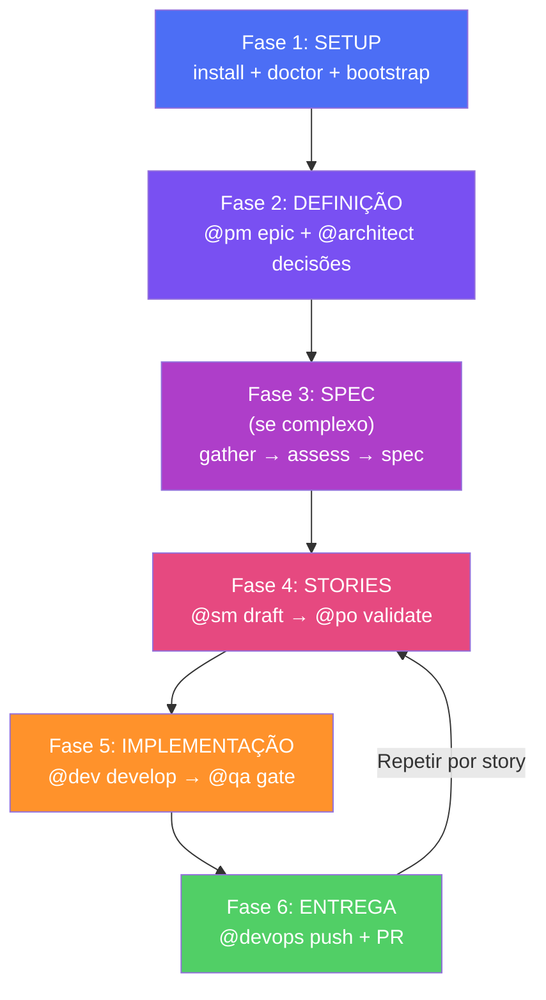

Este módulo guia-te pela sequência completa de criação de um projecto do zero com o AIOS. Cada passo indica o comando exacto, o agente responsável e o output esperado.

---

## Visão Geral da Sequência



---

## Fase 1: Setup

### 1.1 Instalar o AIOS

```bash
npx aios-core install
```

**Output esperado:**
```
✅ .aios-core/ created
✅ .claude/ configured
✅ core-config.yaml generated
✅ AIOS installed successfully
```

### 1.2 Validar o ambiente

```bash
npx aios-core doctor
```

Todos os checks devem passar. Se algum falhar, resolve antes de avançar (ver [Módulo 2: Troubleshooting](/nivel-1-fundamentos/modulo-2-instalacao-anatomia/#troubleshooting--5-erros-comuns)).

### 1.3 Bootstrap do ambiente

```
@devops *environment-bootstrap
```

O @devops (Gage) executa:
- `git init` (se ainda não é repo)
- Configura remote no GitHub
- Configura CI/CD base (GitHub Actions)
- Cria branch strategy (main + feat/*)

**Output esperado:** Repo inicializado, remote configurado, CI/CD básico.

---

## Fase 2: Definição

### 2.1 Criar Epic com PRD

```
@pm *create-epic
```

O @pm (Morgan) guia-te pela criação do epic:
- Define o objectivo do projecto
- Lista requisitos funcionais (FR-*)
- Lista requisitos não-funcionais (NFR-*)
- Define constraints (CON-*)
- Estabelece success metrics

**Output esperado:** Epic file + PRD com requisitos formais.

### 2.2 Decisões de Arquitectura

```
@architect
```

A @architect (Aria) toma decisões técnicas:
- Stack tecnológica (frontend, backend, DB)
- Padrões de arquitectura (monolito, microservices, etc.)
- Integrações externas

### 2.3 Schema Inicial (se BD)

```
@data-engineer
```

O @data-engineer (Dara) define:
- Schema da base de dados
- Migrations iniciais
- RLS policies (se Supabase)

---

## Fase 3: Spec (se complexo)

Se o projecto tem features complexas (complexidade ≥ 9), corre o Spec Pipeline antes de criar stories:

```
@pm *gather-requirements          # 1. Recolher requisitos
@architect                        # 2. Assess (complexidade)
@analyst                          # 3. Research (se STANDARD/COMPLEX)
@pm *write-spec                   # 4. Escrever spec
@qa                               # 5. Critique (validar spec)
@architect                        # 6. Plan (se APPROVED)
```

Se a feature é simples (complexidade ≤ 8), salta esta fase e vai directamente para Fase 4.

Referência: [Módulo 5: Spec Pipeline](/nivel-2-arquitectura/modulo-5-workflows/#workflow-3-spec-pipeline)

---

## Fase 4: Stories

### 4.1 Criar Story

```
@sm *draft
```

O @sm (River) cria a story a partir do epic:
- User story format (Como X, quero Y, para que Z)
- Acceptance criteria específicos e testáveis
- File List placeholder
- Status: Draft

**Output esperado:** `X.Y.story.md` no directório de stories.

### 4.2 Validar Story

```
@po *validate-story-draft
```

O @po (Pax) executa a validação de 10 pontos:
- Clareza da user story
- AC específicos e mensuráveis
- Scope definido
- Dependências identificadas
- ...

**Decisão:**
- **GO (≥ 7/10):** Story aprovada → Fase 5
- **NO-GO (< 7):** Fixes listados → volta ao @sm

---

## Fase 5: Implementação

### 5.1 Desenvolver

```
@dev *develop
```

O @dev (Dex) implementa a story:
1. Lê story e acceptance criteria
2. Cria branch: `feat/story-X.Y`
3. Implementa cada AC
4. Corre `npm run lint` + `npm run typecheck` + `npm test`
5. Actualiza checkboxes na story
6. Actualiza File List
7. Commit: `feat: implement feature [Story X.Y]`

**Modos de execução:**
- **Interactive:** Confirma cada passo
- **YOLO:** Executa tudo autonomamente
- **Pre-Flight:** Mostra plano sem executar

### 5.2 Quality Gate

```
@qa *qa-gate
```

O @qa (Quinn) executa 7 quality checks:
1. Código compila sem erros
2. Lint passa
3. Typecheck passa
4. Testes passam
5. AC todos implementados
6. Sem vulnerabilidades de segurança
7. Convenções de código seguidas

**Decisão:**
- **PASS:** Story aprovada → Fase 6
- **FAIL:** Feedback ao @dev → QA Loop (max 5 iterações)
- **CONCERNS:** Passa com observações
- **WAIVED:** Bypass justificado (raro)

Referência: [Módulo 5: QA Loop](/nivel-2-arquitectura/modulo-5-workflows/#workflow-2-qa-loop)

---

## Fase 6: Entrega

```
@devops *push
```

O @devops (Gage) executa:
1. Verifica que todos os quality gates passaram
2. `git push` para o remote
3. `gh pr create` com título e descrição formatados
4. Associa PR à story

**Output esperado:** PR criado no GitHub, pronto para review/merge.

---

## Repetir Fases 4-6

Para cada story do epic, repete:
1. `@sm *draft` → criar story
2. `@po *validate` → validar
3. `@dev *develop` → implementar
4. `@qa *qa-gate` → quality check
5. `@devops *push` → entregar

Até todas as stories do epic estarem Done.

---

## Troubleshooting — 5 Erros Comuns

### 1. `*environment-bootstrap` falha no git init

**Causa:** Directório já é um repo git.
**Solução:** O @devops detecta e salta este passo automaticamente.

### 2. PO dá NO-GO repetidamente

**Causa:** AC mal definidos pelo @sm.
**Solução:** Revê o epic — os requisitos estão claros? Volta ao @pm se necessário.

### 3. QA Gate falha em lint/typecheck

**Causa:** Código não segue convenções.
**Solução:** QA Loop automático — @dev corrige, @qa re-review (max 5 iterações).

### 4. Branch conflicts ao fazer push

**Causa:** Main avançou enquanto a feature era desenvolvida.
**Solução:** @dev faz `git merge main` no branch de feature, resolve conflitos.

### 5. Story demasiado grande para um ciclo

**Causa:** Story com scope excessivo.
**Solução:** @sm divide em stories mais pequenas. Regra: se demora mais de 1-2 dias, é grande demais.

---

## Exercício

**Cria um projecto SaaS simples (ex: task manager) seguindo toda a sequência.**

1. Setup: instala AIOS e corre doctor
2. Definição: cria epic com @pm
3. Stories: cria pelo menos 2 stories com @sm
4. Validação: valida com @po
5. Implementação: desenvolve com @dev
6. QA: corre qa-gate com @qa
7. Entrega: push com @devops
