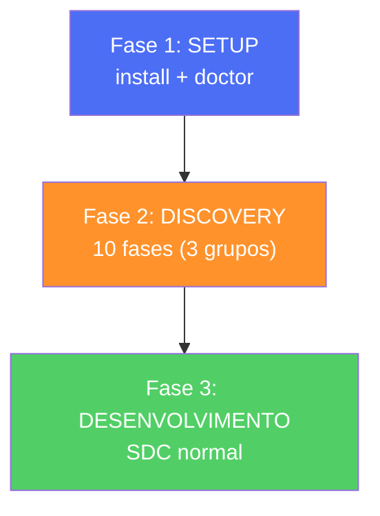

Adoptar o AIOS num projecto existente é diferente de começar do zero. Antes de escrever qualquer código novo, precisas de **entender o que já existe** — arquitectura, base de dados, frontend, tech debt. Para isso, o AIOS tem o Brownfield Discovery: um assessment formal de 10 fases.

---

## Visão Geral



---

## Fase 1: Setup

```bash
npx aios-core install              # Instalar AIOS no projecto existente
npx aios-core doctor               # Validar ambiente
```

Nota: o `install` detecta que já existe código e adapta-se — não sobrescreve ficheiros existentes.

---

## Fase 2: Brownfield Discovery (10 Fases)

### Grupo A: Data Collection (Phases 1-3)

O objectivo é **mapear tudo o que existe** sem alterar nada.

#### Phase 1: Arquitectura do Sistema

```
@architect
```

**Agente:** Aria (Architect)
**Task:** Analisar e documentar a arquitectura actual
**Output:** `system-architecture.md`

O que documenta:
- Stack tecnológica em uso
- Padrões de arquitectura (MVC, microservices, etc.)
- Dependências externas (APIs, serviços)
- Pontos de integração
- Estrutura de pastas

#### Phase 2: Auditoria de Base de Dados

```
@data-engineer
```

**Agente:** Dara (Data Engineer)
**Task:** Auditar schema e estado da BD
**Output:** `SCHEMA.md` + `DB-AUDIT.md`

O que documenta:
- Schema actual (tabelas, relações, índices)
- Migrations existentes (ou falta delas)
- RLS policies (se aplicável)
- Query performance issues
- Data integrity problems

*Se o projecto não tem BD, esta fase é saltada.*

#### Phase 3: Frontend Spec

```
@ux-design-expert
```

**Agente:** Uma (UX Expert)
**Task:** Documentar estado do frontend
**Output:** `frontend-spec.md`

O que documenta:
- Componentes existentes
- Design system (ou falta dele)
- Padrões de UI/UX
- Acessibilidade
- Responsive behavior

---

### Grupo B: Draft & Validation (Phases 4-7)

Com os dados recolhidos, agora **avalia-se e valida-se**.

#### Phase 4: Draft de Tech Debt

```
@architect
```

**Agente:** Aria
**Output:** `technical-debt-DRAFT.md`

Combina os dados das Phases 1-3 e identifica:
- Tech debt por categoria (código, infra, DB, UX)
- Severity de cada item
- Dependências entre items
- Priorização sugerida

#### Phase 5: Review de DB Specialist

```
@data-engineer
```

**Agente:** Dara
**Output:** `db-specialist-review.md`

Valida o draft da Phase 4 na perspectiva de BD:
- Os issues de DB estão correctamente identificados?
- Faltam problemas?
- A priorização faz sentido?

#### Phase 6: Review de UX Specialist

```
@ux-design-expert
```

**Agente:** Uma
**Output:** `ux-specialist-review.md`

Valida o draft na perspectiva de UX:
- Os issues de frontend/UX estão correctos?
- Faltam problemas de acessibilidade?
- A priorização faz sentido?

#### Phase 7: QA Gate

```
@qa
```

**Agente:** Quinn (QA)
**Output:** `qa-review.md`

O QA Gate intermédio decide se o assessment está pronto:

| Verdict | Critério | Próximo passo |
|---------|----------|---------------|
| **APPROVED** | Todos os debits validados, sem gaps críticos, dependencies mapeadas | → Phase 8 |
| **NEEDS WORK** | Gaps não resolvidos, debits mal classificados | → Volta à Phase 4 |

**Este é o gate mais importante do Brownfield Discovery** — se avançar com um assessment incompleto, as stories geradas na Phase 10 vão reflectir essa incompletude.

---

### Grupo C: Finalization (Phases 8-10)

O assessment está validado — agora **formaliza-se e planeia-se**.

#### Phase 8: Tech Debt Assessment Final

```
@architect
```

**Agente:** Aria
**Output:** `technical-debt-assessment.md` (versão final)

Incorpora feedback das Phases 5-7 e produz o documento final com:
- Lista completa de tech debt priorizada
- Recomendações de resolução
- Estimativas de esforço
- Dependências mapeadas

#### Phase 9: Relatório Executivo

```
@analyst
```

**Agente:** Atlas (Analyst)
**Output:** `TECHNICAL-DEBT-REPORT.md`

Versão executiva para stakeholders:
- Resumo de alto nível
- Riscos principais
- ROI da resolução de tech debt
- Timeline sugerida

#### Phase 10: Epic + Stories

```
@pm
```

**Agente:** Morgan (PM)
**Output:** Epic file + stories prontas para desenvolvimento

Transforma o assessment em trabalho executável:
- Cria epic com base no tech debt report
- Gera stories para cada item priorizado
- Define acceptance criteria
- Stories prontas para o SDC (Fase 3)

---

## Fase 3: Desenvolvimento

A partir daqui, o fluxo é **idêntico ao Greenfield** (Fase 4 em diante):

```
@sm *draft → @po *validate → @dev *develop → @qa *qa-gate → @devops *push
```

Repetir para cada story gerada na Phase 10.

Referência: [Módulo 6: Fases 4-6](/nivel-3-pratica/modulo-6-greenfield/#fase-4-stories)

---

### O que já existe vs. O que o AIOS gera

| Fase | Já existe no projecto | O AIOS gera |
|------|----------------------|-------------|
| Phase 1 | Código, config, dependencies | `system-architecture.md` |
| Phase 2 | Schema, queries, migrations | `SCHEMA.md`, `DB-AUDIT.md` |
| Phase 3 | Componentes, CSS, layouts | `frontend-spec.md` |
| Phase 4 | — | `technical-debt-DRAFT.md` |
| Phase 5 | — | `db-specialist-review.md` |
| Phase 6 | — | `ux-specialist-review.md` |
| Phase 7 | — | `qa-review.md` (APPROVED/NEEDS WORK) |
| Phase 8 | — | `technical-debt-assessment.md` (final) |
| Phase 9 | — | `TECHNICAL-DEBT-REPORT.md` |
| Phase 10 | — | Epic + stories prontas para SDC |

---

## Troubleshooting — 5 Erros Comuns

### 1. `aios install` sobrescreve ficheiros existentes

**Causa:** Não acontece — o installer detecta ficheiros existentes.
**Solução:** Se desconfias, faz backup antes: `git stash` ou commit prévio.

### 2. Phase 1 não consegue mapear a arquitectura

**Causa:** Projecto sem documentação, sem README, estrutura confusa.
**Solução:** A @architect analisa o código directamente. Pode demorar mais.

### 3. QA Gate (Phase 7) dá NEEDS WORK repetidamente

**Causa:** Assessment incompleto ou contraditório.
**Solução:** Revê os outputs das Phases 4-6. Algum agente falhou na análise? Repete a fase específica.

### 4. Phase 10 gera demasiadas stories

**Causa:** Tech debt extenso.
**Solução:** O @pm prioriza — nem tudo precisa de ser resolvido imediatamente. Foca no high-severity primeiro.

### 5. Projecto sem BD — Phases 2 e 5 falham

**Causa:** Fases de BD não aplicáveis.
**Solução:** São saltadas automaticamente. O workflow continua com Phases 1, 3, 4, 6, 7-10.

---

## Exercício

**Pega num projecto pessoal existente, instala o AIOS e corre as 10 fases de discovery.**

1. Escolhe um projecto com pelo menos 1000 linhas de código
2. Instala: `npx aios-core install && npx aios-core doctor`
3. Corre as 10 fases sequencialmente
4. No final: quantos items de tech debt foram identificados?
5. Qual é o top 3 de prioridade?
