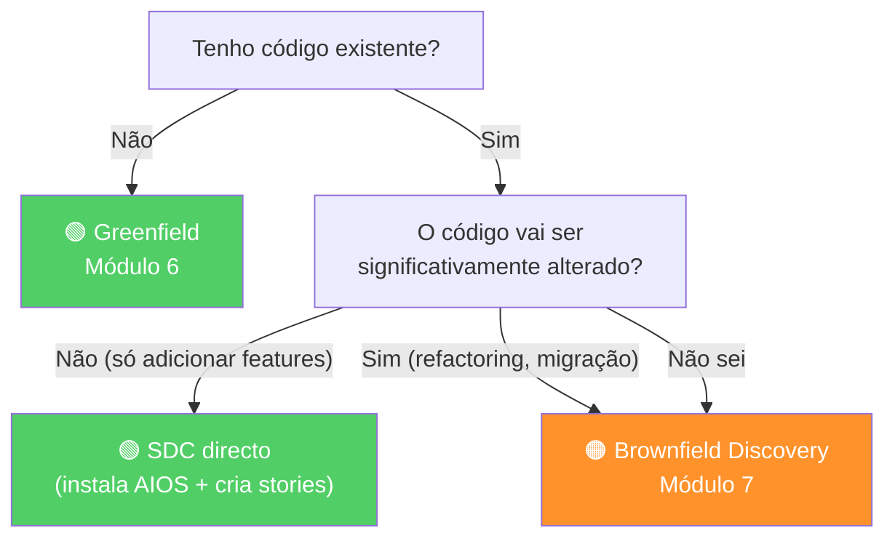

Agora que conheces ambas as sequências, vamos compará-las directamente. A escolha entre Greenfield e Brownfield é a primeira decisão prática que tomas ao adoptar o AIOS.

---

## Tabela Comparativa

| Aspecto | Greenfield | Brownfield |
|---------|-----------|------------|
| **Primeiro passo** | `*environment-bootstrap` | Brownfield Discovery (10 fases) |
| **Tempo de setup** | 1-2 horas | 1-2 dias (discovery completo) |
| **Quem lidera o início** | @pm (cria epic) | @architect (assessment) |
| **Risco principal** | Over-engineering | Tech debt oculta |
| **Quando usar Spec Pipeline** | Features complexas (score ≥9) | Sempre recomendado no início |
| **Output inicial** | Epic → Stories directo | Tech Debt Report → Epic → Stories |
| **Agentes envolvidos no setup** | @pm, @architect, @devops | Todos os 10 agentes |
| **Primeira story** | Imediata após epic | Após 10 fases de discovery |
| **Nível de incerteza** | Baixo (tudo é novo) | Alto (código existente pode surpreender) |
| **Custo de falhar** | Baixo (pouco investido) | Alto (código existente em risco) |

---

## Fluxo Lado-a-Lado

```mermaid
graph TD
    subgraph GREEN["🟢 Greenfield"]
        G1["Setup + Bootstrap"] --> G2["@pm Epic + PRD"]
        G2 --> G3["@sm Stories"]
        G3 --> G4["@dev Implement"]
        G4 --> G5["@qa QA Gate"]
        G5 --> G6["@devops Push"]
    end

    subgraph BROWN["🟠 Brownfield"]
        B1["Install AIOS"] --> B2["Discovery 10 fases<br/>(todos os agentes)"]
        B2 --> B3["QA Gate intermédio"]
        B3 -->|APPROVED| B4["Tech Debt Report"]
        B3 -->|"NEEDS WORK"| B2
        B4 --> B5["@pm Epic + Stories"]
        B5 --> B6["SDC normal<br/>(igual a Greenfield)"]
    end

    style G1 fill:#51cf66,color:#fff
    style G6 fill:#51cf66,color:#fff
    style B1 fill:#ff922b,color:#fff
    style B6 fill:#51cf66,color:#fff
```

**Observa:** Após o discovery brownfield, o fluxo de desenvolvimento é **exactamente o mesmo** (SDC). A diferença está apenas no setup.

---

## Árvore de Decisão

**Regra simples:**
- **Sem código** → Greenfield
- **Com código + alterações grandes** → Brownfield
- **Com código + features novas apenas** → Instala AIOS + SDC directo
- **Em dúvida** → Brownfield (é mais seguro)

---

## 5 Cenários Reais

### Cenário 1: App nova para startup

**Situação:** Zero código, ideia definida, equipa de 3.
**Recomendação:** **Greenfield**
**Porquê:** Não há código existente para avaliar. Começa com epic e avança.

### Cenário 2: API existente mas frontend novo

**Situação:** Backend em Node.js estável, precisa de frontend React.
**Recomendação:** **Brownfield para backend** (avaliar API e schema) + **Greenfield para frontend** (novo de raiz).
**Porquê:** O backend tem código que pode ter tech debt oculto. O frontend é novo.

### Cenário 3: Migração de PHP monolito para microservices

**Situação:** App PHP de 5 anos, 50K linhas, quer migrar para Node.js.
**Recomendação:** **Brownfield Discovery completo**
**Porquê:** Sem assessment, vais migrar problemas em vez de resolvê-los.

### Cenário 4: Adicionar feature de pagamentos a app existente

**Situação:** App funcional, quer adicionar Stripe.
**Recomendação:** **Instala AIOS + Spec Pipeline + SDC**
**Porquê:** Não precisa de discovery completo — a app funciona. Mas a feature é complexa o suficiente para spec.

### Cenário 5: Herdar projecto de developer que saiu

**Situação:** Projecto sem documentação, sem testes, developer saiu.
**Recomendação:** **Brownfield Discovery completo**
**Porquê:** Máxima incerteza. Precisas de mapear tudo antes de tocar em qualquer coisa.

---

## Exercício

**Dado estes 5 cenários, escolhe e justifica Greenfield ou Brownfield:**

1. E-commerce com 3 anos, quer redesign completo do frontend
2. MVP para hackathon (deadline: 48h)
3. Projecto open-source que queres contribuir pela primeira vez
4. App mobile com backend Firebase, quer migrar para Supabase
5. Nova feature de chat real-time para app existente com boa documentação

**Respostas sugeridas:**
1. Brownfield (código existente + mudanças significativas no frontend)
2. Greenfield (zero código, time-boxed, velocidade é prioridade)
3. Brownfield Discovery (código existente desconhecido)
4. Brownfield (migração de infra = mudança significativa)
5. SDC directo + Spec Pipeline (app estável, feature complexa mas localizada)
