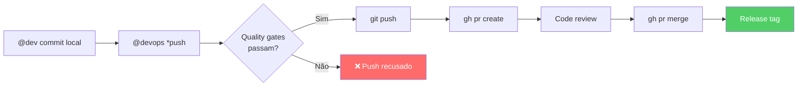

Usar o AIOS localmente é o início. Usá-lo em produção com CI/CD, quality gates automáticos e integrações é o que o torna profissional.

---

## Pre-Push Quality Gates

Antes de qualquer push, 3 gates obrigatórios devem passar:

```bash
npm run lint        # ESLint — estilo e erros estáticos
npm run typecheck   # TypeScript — segurança de tipos
npm test            # Jest — testes unitários e integração
```

### Configuração

Os quality gates são enforced pelo @qa durante o QA Gate e pelo @devops antes do push:

```
@dev implementa → @qa *qa-gate (7 checks) → @devops *push (verifica gates)
```

Se algum gate falhar:
1. @devops **recusa o push**
2. O developer recebe feedback específico
3. QA Loop activa para correcção (max 5 iterações)

**Sem excepções** — é o Artigo V (Quality First) da Constitution.

---

## @devops — Operações Exclusivas

O @devops (Gage) é o **único agente** com autoridade para operações que afectam o remote:

### Fluxo Completo: Push → PR → Merge → Release



### Comandos do @devops

| Comando | Acção |
|---------|-------|
| `*push` | Verificar gates + push + criar PR |
| `*environment-bootstrap` | Inicializar git, remote, CI/CD |
| `*setup-mcp-docker` | Configurar MCP Docker Gateway |
| `*add-mcp` | Adicionar servidor MCP |
| `*list-mcps` | Listar MCPs activos |

---

## MCP & Integrações

O AIOS integra com ferramentas externas via MCP (Model Context Protocol). As ferramentas são organizadas em 3 Tiers:

### Tier 1: Sempre Disponíveis

Ferramentas nativas do Claude Code — sem MCP necessário:

| Ferramenta | Uso |
|------------|-----|
| `Read` | Ler ficheiros |
| `Write` / `Edit` | Escrever/editar ficheiros |
| `Bash` | Comandos shell |
| `Grep` | Pesquisar conteúdo |
| `Glob` | Pesquisar ficheiros |

### Tier 2: Carregadas com Agentes

| MCP | Propósito | Quando usar |
|-----|-----------|-------------|
| **Context7** | Documentação de libraries | Preciso de docs do React/Supabase/Jest |
| **git** | Operações git | Branch, commit, diff, log |
| **CodeRabbit** | Code review automatizado | Pre-commit, pre-PR |

### Tier 3: Sob Demanda (Docker Gateway)

| MCP | Propósito | Quando usar |
|-----|-----------|-------------|
| **EXA** | Web search | Research, análise competitiva |
| **Playwright** | Browser automation | Testes UI, screenshots |
| **Apify** | Web scraping | Extracção de dados |

### Quando usar cada ferramenta

| Tarefa | Ferramenta correcta |
|--------|---------------------|
| Ler ficheiro local | `Read` (Tier 1) — **não** docker-gateway |
| Pesquisar docs do React | Context7 (Tier 2) |
| Pesquisar na web | EXA via Docker (Tier 3) |
| Testes de browser | Playwright (Tier 3) |
| Code review | CodeRabbit (Tier 2) |

**Regra:** Sempre prefere Tier 1 > Tier 2 > Tier 3. Ferramentas nativas são mais rápidas e fiáveis.

---

## `aios graph` — Visualização de Dependências

O AIOS inclui uma ferramenta de visualização de dependências:

### Formatos disponíveis

| Comando | Formato | Uso |
|---------|---------|-----|
| `aios graph --deps` | ASCII | Terminal — rápido, sem dependências |
| `aios graph --deps --format=json` | JSON | Processamento programático |
| `aios graph --deps --format=html` | HTML interactivo | Browser — drag, zoom, filter |
| `aios graph --deps --format=mermaid` | Mermaid | Documentação, markdown |
| `aios graph --deps --format=dot` | DOT (Graphviz) | Ferramentas externas |
| `aios graph --stats` | Estatísticas | Métricas de dependências |

### Exemplo: ASCII

```bash
aios graph --deps
```

```
packages/auth/
├── packages/db/ (direct)
│   └── packages/config/ (transitive)
├── packages/utils/ (direct)
└── packages/types/ (direct)
```

### Exemplo: Estatísticas

```bash
aios graph --stats
```

```
Total packages: 8
Direct dependencies (avg): 2.3
Max depth: 4
Circular dependencies: 0
Most depended on: packages/types (6 consumers)
```

---

## Debug e Monitorização

### Activar modo debug

```bash
export AIOS_DEBUG=true
```

Com debug activo:
- Logs detalhados de cada operação
- Timestamps em todas as acções
- Stack traces em erros
- Performance metrics

### Logs

```bash
tail -f .aios/logs/agent.log       # Log de operações de agentes
```

### Trace

O trace permite seguir a execução de um workflow passo a passo:
- Que task foi carregada
- Que template foi usado
- Que checklist foi executado
- Quanto tempo cada passo demorou

---

## Boas Práticas para Equipas

### Convenções Git

| Convenção | Exemplo |
|-----------|---------|
| Conventional Commits | `feat: add export [Story 2.1]` |
| Branch naming | `feat/story-2.1-export-csv` |
| PR title | `feat: implement CSV export (#42)` |

### Branch Strategy

```
main                          # Produção
├── feat/story-2.1-export     # Feature branches
├── feat/story-2.2-auth       #
├── fix/story-2.3-bug         # Bug fixes
└── docs/update-readme        # Documentação
```

**Regras:**
- `main` é protegida — só @devops faz merge
- Feature branches a partir de `main`
- PR obrigatório para merge
- Quality gates passam antes do merge

### Code Review com CodeRabbit

O CodeRabbit é integrado como MCP Tier 2 para code review automatizado:

```bash
# Pre-commit (uncommitted changes)
coderabbit --prompt-only -t uncommitted

# Pre-PR (branch vs main)
coderabbit --prompt-only --base main
```

O review produz:
- Issues por severity (critical, warning, info)
- Sugestões de melhoria
- Security flags
- Self-healing: até 2 iterações automáticas de fix

---

## Exercício

**Configurar pipeline completo: dev → QA gate → push → PR.**

1. Implementa uma feature simples com `@dev *develop`
2. Corre `@qa *qa-gate` — todos os 7 checks passam?
3. Se FAIL: corre QA Loop até PASS
4. Faz `@devops *push` — os pre-push gates passam?
5. Verifica o PR criado no GitHub
6. Activa `AIOS_DEBUG=true` e repete — observa os logs
7. Corre `aios graph --stats` — como estão as dependências?
