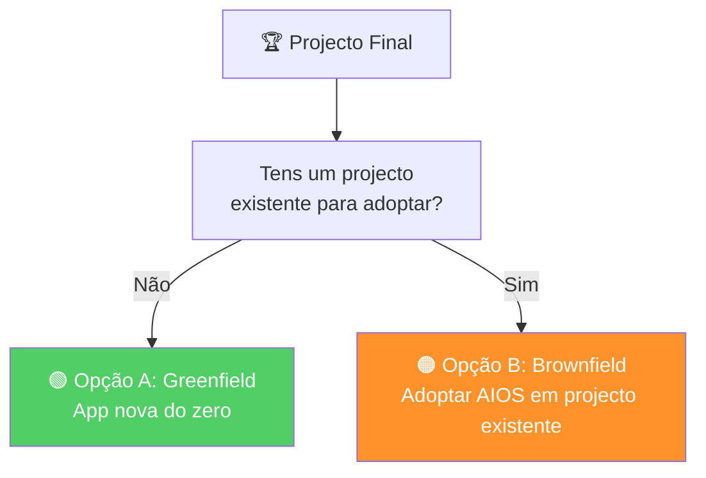

Este é o módulo mais importante do curso. Tudo o que aprendeste nos módulos 0-11 converge aqui num projecto real, completo, e que podes mostrar como portfolio. Escolhe uma das duas opções e segue o guia.

---

## Escolhe a Tua Opção



| Aspecto | Opção A: Greenfield | Opção B: Brownfield |
|---------|--------------------|--------------------|
| **Para quem** | Quem quer construir algo novo | Quem tem um projecto a precisar de estrutura |
| **Duração estimada** | 3-5 dias | 4-7 dias |
| **Dificuldade** | Média | Alta |
| **O que demonstra** | Domínio do fluxo completo | Capacidade de adopção em contexto real |
| **Módulos mais usados** | 0-6, 9-11 | 0-5, 7-8, 10-11 |

---

## Opção A: Greenfield — App Completa

### Briefing

Construir uma aplicação SaaS completa usando toda a sequência AIOS. Sugestões de projecto:

- **Task Manager** — CRUD de tarefas com categorias, prioridades e filtros
- **Expense Tracker** — Registo de despesas com categorias e dashboard
- **Blog Platform** — CMS simples com posts, tags e autores
- **Booking System** — Reservas com calendário e confirmação

Podes escolher outro projecto, desde que tenha complexidade suficiente para 5+ stories.

### Requisitos Obrigatórios

#### 1. Setup e Definição

```
npx aios-core install
npx aios-core doctor             # Todos os checks passam
@devops *environment-bootstrap   # Git + remote + CI/CD
@pm *create-epic                 # Epic com PRD formal
```

**Entregável:** Epic file + PRD com:
- Pelo menos 5 requisitos funcionais (FR-*)
- Pelo menos 2 requisitos não-funcionais (NFR-*)
- Success metrics definidas

#### 2. Arquitectura

```
@architect                       # Decisões de stack
@data-engineer                   # Schema inicial (se BD)
```

**Entregável:** Decisão de stack documentada + schema (se aplicável)

#### 3. Stories (mínimo 5)

```
@sm *draft                       # Criar story
@po *validate-story-draft        # Validar (GO/NO-GO)
```

**Entregável:** 5 stories com:
- User story format correcto
- Acceptance criteria específicos e testáveis
- Todas com status GO após validação pelo @po

#### 4. Implementação

```
@dev *develop                    # Implementar cada story
```

**Entregável:** 5 stories implementadas com:
- Código funcional
- Conventional Commits (`feat: ... [Story X.Y]`)
- Checkboxes actualizados nas stories
- File List actualizado

#### 5. Quality Gates

```
@qa *qa-gate                     # QA em TODAS as stories
@qa *qa-loop                     # QA Loop em pelo menos 2 stories
```

**Entregável:**
- QA Gate executado nas 5 stories (PASS obrigatório)
- QA Loop executado em pelo menos 2 stories (demonstrar ciclo fix/review)
- Métricas: QA pass rate, número de iterações por story

#### 6. Entrega

```
@devops *push                    # Push + PR para cada story
```

**Entregável:** PRs criados no GitHub, com título e descrição formatados.

---

## Opção B: Brownfield — Adopção em Projecto Existente

### Briefing

Adoptar o AIOS num projecto existente teu (ou open-source que conheces bem). O projecto deve ter:
- Pelo menos 1000 linhas de código
- Alguma complexidade (não um hello world)
- Espaço para melhoria (tech debt, falta de testes, etc.)

### Requisitos Obrigatórios

#### 1. Setup

```
npx aios-core install
npx aios-core doctor             # Todos os checks passam
```

**Entregável:** AIOS instalado no projecto existente.

#### 2. Brownfield Discovery Completo (10 fases)

```
# Data Collection
@architect                       # Phase 1: system-architecture.md
@data-engineer                   # Phase 2: SCHEMA.md + DB-AUDIT.md (se BD)
@ux-design-expert                # Phase 3: frontend-spec.md

# Draft & Validation
@architect                       # Phase 4: tech-debt-DRAFT.md
@data-engineer                   # Phase 5: db-specialist-review.md
@ux-design-expert                # Phase 6: ux-specialist-review.md
@qa                              # Phase 7: QA Gate (APPROVED/NEEDS WORK)

# Finalization
@architect                       # Phase 8: tech-debt-assessment.md (final)
@analyst                         # Phase 9: TECHNICAL-DEBT-REPORT.md
@pm                              # Phase 10: Epic + stories
```

**Entregável:** Todos os artefactos das 10 fases + QA Gate APPROVED.

#### 3. Tech Debt Report

**Entregável:** `TECHNICAL-DEBT-REPORT.md` com:
- Resumo executivo
- Lista de tech debt priorizada (CRITICAL → LOW)
- Recomendações de resolução
- Timeline sugerida

#### 4. Epic e Stories (mínimo 5)

```
@sm *draft                       # Criar 5 stories do epic
@po *validate-story-draft        # Validar todas
```

**Entregável:** 5 stories validadas (GO) derivadas do discovery.

#### 5. Implementação (mínimo 3 stories)

```
@dev *develop                    # Implementar 3 stories
@qa *qa-gate                     # QA Gate em cada
```

**Entregável:** 3 stories implementadas com QA PASS.

#### 6. Demonstrar Melhoria

**Entregável:** Comparação Before/After:
- Quantos items de tech debt foram resolvidos?
- Métricas de qualidade antes e depois (lint errors, test coverage, etc.)
- O que mudou no workflow da equipa?

---

## Critérios de Avaliação

### Opção A: Greenfield

| Critério | Peso | PASS | FAIL |
|----------|------|------|------|
| Epic + PRD com FR/NFR | 15% | Epic formal com ≥5 FR e ≥2 NFR | Sem epic ou requisitos informais |
| 5 stories validadas (GO) | 15% | 5 stories com GO do @po | <5 stories ou sem validação |
| 5 stories implementadas | 20% | Código funcional, AC cumpridos | AC não cumpridos |
| QA PASS em todas | 20% | 5/5 QA PASS | <5 QA PASS |
| QA Loop em ≥2 stories | 10% | Demonstrar ciclo fix/review | Sem QA Loop |
| Conventional Commits | 10% | Todos os commits seguem convenção | Commits sem convenção |
| Push + PRs via @devops | 10% | PRs criados correctamente | Push directo sem PR |

### Opção B: Brownfield

| Critério | Peso | PASS | FAIL |
|----------|------|------|------|
| Discovery completo (10 fases) | 20% | Todos os artefactos gerados | Fases saltadas |
| QA Gate APPROVED (Phase 7) | 10% | APPROVED | NEEDS WORK sem resolução |
| Tech Debt Report | 15% | Report completo com priorização | Report incompleto |
| 5 stories validadas | 15% | 5 stories com GO | <5 stories |
| 3 stories implementadas com QA | 20% | 3/3 QA PASS | <3 implementadas |
| Demonstração Before/After | 20% | Métricas comparativas claras | Sem comparação |

### Escala de Avaliação

| Score | Nível | Descrição |
|-------|-------|-----------|
| 90-100% | **Excelente** | Domínio completo do AIOS |
| 75-89% | **Bom** | Bom domínio, detalhes a melhorar |
| 60-74% | **Suficiente** | Conceitos base adquiridos, precisa prática |
| <60% | **Insuficiente** | Revisitar módulos anteriores |

---

## Template de Submissão

Ao concluir o projecto, preenche este template e inclui no repo:

```markdown
# Projecto Final — Curso AIOS

## Informação Geral
- **Nome:** [teu nome]
- **Opção:** [A: Greenfield / B: Brownfield]
- **Projecto:** [nome/descrição do projecto]
- **Repo:** [link para o repositório]
- **Data de início:** [data]
- **Data de conclusão:** [data]

## Resumo do Projecto
[2-3 parágrafos descrevendo o projecto, objectivos e resultado final]

## Decisões Tomadas

### Stack Tecnológica
| Tecnologia | Escolha | Justificação |
|------------|---------|--------------|
| Frontend | | |
| Backend | | |
| Database | | |
| Hosting | | |

### Decisões de Arquitectura
1. [Decisão 1 — porquê]
2. [Decisão 2 — porquê]
3. [Decisão 3 — porquê]

## Métricas

### Stories
| Métrica | Valor |
|---------|-------|
| Total de stories criadas | |
| Stories validadas (GO) | |
| Stories implementadas | |
| QA PASS (primeira tentativa) | |
| QA PASS (após QA Loop) | |
| QA FAIL (não resolvido) | |

### Quality
| Métrica | Valor |
|---------|-------|
| QA pass rate | [X]% |
| Média de iterações QA Loop | |
| Lint errors no final | |
| Typecheck errors no final | |
| Test coverage | [X]% |

### Commits
| Métrica | Valor |
|---------|-------|
| Total de commits | |
| Commits com Conventional format | |
| Stories referenciadas em commits | |

## Workflow Utilizado
[Descreve que workflows usaste e porquê]
- SDC: [quantas vezes]
- QA Loop: [quantas vezes]
- Spec Pipeline: [sim/não — porquê]

## Agentes Utilizados
| Agente | Quando | Para quê |
|--------|--------|----------|
| @pm | | |
| @sm | | |
| @po | | |
| @dev | | |
| @qa | | |
| @devops | | |
| @architect | | |

## Dificuldades Encontradas
1. [Dificuldade 1 — como resolveste]
2. [Dificuldade 2 — como resolveste]
3. [Dificuldade 3 — como resolveste]

## Lições Aprendidas
1. [Lição 1]
2. [Lição 2]
3. [Lição 3]

## Antes vs Depois (Opção B apenas)
| Métrica | Antes | Depois |
|---------|-------|--------|
| Tech debt items | | |
| Lint errors | | |
| Test coverage | | |
| Documentação | | |

## Auto-avaliação
[Avalia o teu trabalho honestamente — o que fizeste bem, o que farias diferente]
```

---

## Checklist de Entrega

Antes de submeter, verifica:

### Opção A: Greenfield
- [ ] AIOS instalado e `aios doctor` passa
- [ ] Epic + PRD criado com @pm
- [ ] Decisões de arquitectura documentadas
- [ ] 5 stories criadas com @sm
- [ ] 5 stories validadas (GO) com @po
- [ ] 5 stories implementadas com @dev
- [ ] QA Gate PASS em 5/5 stories
- [ ] QA Loop demonstrado em ≥2 stories
- [ ] Todos os commits seguem Conventional Commits
- [ ] Push + PRs via @devops
- [ ] Template de submissão preenchido
- [ ] `aios graph --stats` incluído nas métricas

### Opção B: Brownfield
- [ ] AIOS instalado no projecto existente
- [ ] Brownfield Discovery completo (10 fases)
- [ ] QA Gate APPROVED (Phase 7)
- [ ] Tech Debt Report completo
- [ ] 5 stories criadas e validadas (GO)
- [ ] 3 stories implementadas com QA PASS
- [ ] Comparação Before/After documentada
- [ ] Template de submissão preenchido
- [ ] `aios graph --stats` incluído nas métricas

---

## Dicas para Sucesso

1. **Não saltes passos.** O valor do projecto final é demonstrar o processo completo, não apenas o código.
2. **Documenta decisões.** Cada vez que escolhes algo (stack, padrão, prioridade), anota porquê.
3. **Deixa o QA Loop correr.** Não corrijas tudo antes do QA — deixa o processo natural funcionar.
4. **Usa `aios graph`.** Mostra que sabes monitorar dependências.
5. **Sê honesto na auto-avaliação.** O que aprendeste é mais importante que um score perfeito.
6. **Referencia os módulos.** Quando usares algo que aprendeste (ex: Constitution, handoff, boundary), menciona o módulo.

---

## O Que Vem Depois

Ao completar o projecto final, tens:
- **Portfolio piece** — um projecto completo com processo profissional documentado
- **Domínio do AIOS** — sabes usar todos os agentes, workflows e ferramentas
- **Capacidade de customização** — podes criar agentes e squads para qualquer domínio
- **Mindset de qualidade** — quality gates são o teu padrão, não a excepção

O próximo passo é usar o AIOS nos teus projectos reais — e ensinar outros a fazê-lo.
