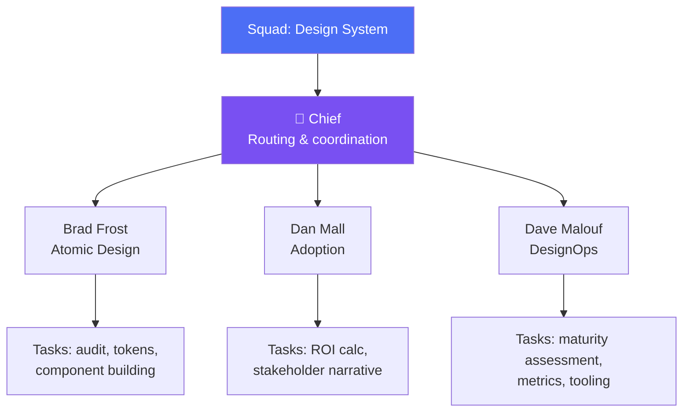

Os 10 agentes core do AIOS cobrem o ciclo de desenvolvimento. Mas e quando precisas de expertise num domínio específico — design systems, copywriting, cybersecurity, paid traffic? É para isso que existem os **Squads**.

---

## O que são Squads

Um Squad é uma **equipa de agentes especializados** num domínio específico. Diferem dos agentes individuais em:

| Aspecto | Agente Individual | Squad |
|---------|-------------------|-------|
| **Escopo** | 1 papel (ex: QA) | Múltiplos papéis num domínio |
| **Coordenação** | Opera sozinho | Chief + especialistas |
| **Activação** | `@agent-name` | `@squad-name` |
| **Localização** | `.aios-core/development/agents/` | `squads/{squad-name}/` |
| **Complexidade** | Simples | Sistema de Tiers (0-3) |

### Estrutura de um Squad

```
squads/
└── design-system/
    ├── agents/
    │   ├── brad-frost.md        # Atomic Design specialist
    │   ├── dan-mall.md          # Adoption & stakeholder buy-in
    │   └── dave-malouf.md       # DesignOps & process
    ├── tasks/                   # Tasks específicas do squad
    ├── templates/               # Templates específicos
    └── README.md                # Documentação do squad
```

---

## Relação Squad → Agentes → Tasks



**Fluxo:**
1. Activas o squad
2. O **Chief** analisa o teu pedido (Tier 0: routing)
3. O Chief delega ao **especialista** certo (Tier 1-2)
4. O especialista executa com tasks e templates do squad

---

## Squad Creator

Para criar squads customizados, usa o `@squad-creator`:

```
@squad-creator
```

O squad creator guia-te pela criação:
1. **Domínio:** Qual a área de expertise?
2. **Agentes:** Quantos e com que papéis?
3. **Mind Cloning:** Baseados em que referências?
4. **Tasks:** Que tarefas executam?
5. **Templates:** Que outputs produzem?

---

## Mind Cloning

Mind cloning é a técnica de **capturar padrões de pensamento** de referências do domínio. Cada agente de squad é modelado a partir de uma referência real:

| Componente | O que captura |
|------------|---------------|
| **Voice DNA** | Tom, vocabulário, estilo de comunicação |
| **Thinking DNA** | Modelos mentais, frameworks decisórios |
| **SOPs** | Standard Operating Procedures — como executa tarefas |
| **Expertise** | Conhecimento técnico específico |

**Exemplo:** O agente `brad-frost` no Design System Squad é modelado a partir dos livros e artigos de Brad Frost sobre Atomic Design. O agente "pensa" em átomos, moléculas, organismos, templates e páginas.

---

## Squads Existentes

### Design System Squad

**Domínio:** Design systems, component libraries, design tokens.

| Agente | Referência | Especialidade |
|--------|-----------|---------------|
| Brad Frost | Atomic Design | Audit, tokens, pattern consolidation, component building |
| Dan Mall | Design System adoption | ROI, stakeholder buy-in, adoption narrative |
| Dave Malouf | DesignOps | Maturity assessment, process optimization, metrics |

**Quando usar:** Criar ou melhorar design system, auditar componentes existentes, extrair tokens, planear migração.

### Copy Chief Squad

**Domínio:** Copywriting, messaging, brand voice.

**Estrutura:** 24 copywriters lendários organizados em Tiers.
- **Tier 0:** Diagnóstico — qual o problema de copy?
- **Tier 1-3:** Execução — copywriter certo para o problema
- **Auditoria Hopkins:** Validação final

**Quando usar:** Landing pages, email campaigns, product descriptions, brand messaging.

### Cyber Chief Squad

**Domínio:** Cybersecurity.

**Estrutura:** 6 especialistas de segurança.
- Triagem de problemas
- Routing para especialista certo
- Coordenação de operações

**Quando usar:** Security audits, penetration testing planning, incident response, compliance.

### Traffic Masters Squad

**Domínio:** Paid traffic e performance marketing.

**Estrutura:** 7 especialistas.
- **Tier 0:** Estratégia
- **Tier 1:** Platform Masters (Google, Meta, TikTok, etc.)
- **Tier 2:** Scaling

**Quando usar:** Campaign setup, audience targeting, budget optimization, scaling strategies.

---

## Criar Squads Customizados

### Exemplo: Squad para o teu domínio

Imagina que trabalhas em fintech. Podes criar um squad com:

```
@squad-creator

Domínio: Fintech & Financial Services
Agentes:
  1. Compliance Officer — regulação financeira, KYC/AML
  2. Risk Analyst — risk modeling, fraud detection
  3. Payment Specialist — payment gateways, PCI-DSS
```

O squad creator gera:
- Ficheiros de agente com persona e mind cloning
- Tasks específicas do domínio
- Templates de output
- README com documentação

---

## Exercício

**Criar um squad customizado para o teu domínio.**

1. Identifica o teu domínio profissional
2. Lista 3 papéis especializados que seriam úteis
3. Para cada papel, define:
   - Nome e referência (pessoa real ou arquétipo)
   - 3 tarefas que executa
   - Que outputs produz
4. Usa `@squad-creator` para gerar o squad
5. Testa: activa o squad e dá-lhe uma tarefa real
